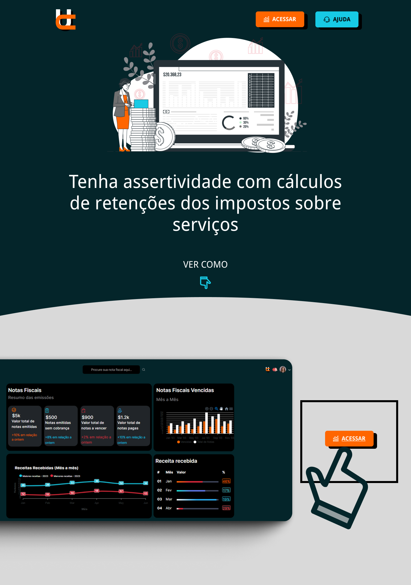

Site : [Clique aqui para ver o site](https://technation-dashboarduc-suamirocha.netlify.app/)

Prototipo Figma: [Veja aqui](https://www.figma.com/proto/mQBmSROGaypBduKGe5ff1S/Dashboard-UC--%F0%9F%A4%8D?page-id=1%3A371&type=design&node-id=302-5&viewport=166%2C-3%2C0.26&t=s6cR6GYNa4pfdnn2-1&scaling=scale-down-width&mode=design)

Arquivo: [Moodboard UI](https://www.figma.com/file/mQBmSROGaypBduKGe5ff1S/Dashboard-UC--%F0%9F%A4%8D?type=design&node-id=1%3A8&mode=design&t=zpMR8eCk8KMiGtPS-1)



Desenvolvido por: [Suami Rocha](www.suamirocha.com.br)
Utilizei ApexjS, ChartJs, Bootstrap 5 e jQuery para realizar esse dashboard.

# Instruções para usar

- Clone o Repositório:

Abra o terminal no seu computador.
Use o comando git clone seguido pelo URL do repositório. Isso cria uma cópia local do repositório no seu computador.
bash
```
git clone https://github.com/nome-do-usuario/suamirochadev/techNation-dashboardUC.git
```

- Navegue para o Diretório do Projeto:

Use o comando cd para navegar até o diretório do projeto.
```
cd dashboarduc
```

- Instale Dependências:

Se o projeto tiver dependências externas, você precisará instalá-las. Isso pode ser feito usando ferramentas como npm (para projetos JavaScript "o nosso caso")

```
npm install   # para projetos JavaScript
```

## Recomendações
Utilize o Live Server para visualizar as modificações em tempo real.
Para utilizar o Live Server que é uma extensão, baixe o VSCode.


Muito obrigada por ler até aqui e até a próxima 🤍🥳